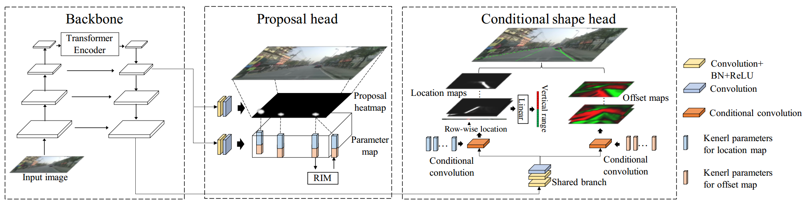
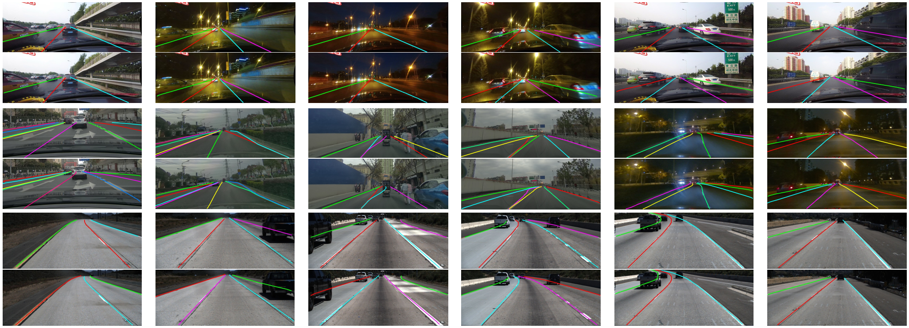

# CondLaneNet: a Top-to-down Lane Detection Framework Based on Conditional Convolution
This is the official implementation code of the paper "CondLaneNet: a Top-to-down Lane Detection Framework Based on ConditionalConvolution". (Link: [https://arxiv.org/abs/2105.05003](https://arxiv.org/abs/2105.05003))
We achieve state-of-the-art performance on multiple lane detection benchmarks. 
Our paper has been accepted by ICCV2021.



## Installation


This implementation is based on mmdetection(v2.0.0). Please refer to [install.md](docs/install.md) for installation.

## Datasets
We conducted experiments on CurveLanes, CULane and TuSimple. Please refer to [dataset.md](dataset.md) for installation. 

## Models
For your convenience, we provide the following trained models on Curvelanes, CULane, and TuSimple datasets

Model | Speed | F1 | Link
--- |:---:|:---:|---:
curvelanes_small | 154FPS | 85.09 | [download](https://virutalbuy-public.oss-cn-hangzhou.aliyuncs.com/share/CondLaneNet/models/curvelanes/curvelanes_small.pth)
curvelanes_medium | 109FPS | 85.92 | [download](https://virutalbuy-public.oss-cn-hangzhou.aliyuncs.com/share/CondLaneNet/models/curvelanes/curvelanes_medium.pth)
curvelanes_large | 48FPS | 86.10 | [download](https://virutalbuy-public.oss-cn-hangzhou.aliyuncs.com/share/CondLaneNet/models/curvelanes/curvelanes_large.pth)
culane_small | 220FPS | 78.14 | [download](https://virutalbuy-public.oss-cn-hangzhou.aliyuncs.com/share/CondLaneNet/models/culane/culane_small.pth)
culane_medium | 152FPS | 78.74 | [download](https://virutalbuy-public.oss-cn-hangzhou.aliyuncs.com/share/CondLaneNet/models/culane/culane_medium.pth)
culane_large | 58FPS | 79.48 | [download](https://virutalbuy-public.oss-cn-hangzhou.aliyuncs.com/share/CondLaneNet/models/culane/culane_large.pth)
tusimple_small | 220FPS | 97.01 | [download](https://virutalbuy-public.oss-cn-hangzhou.aliyuncs.com/share/CondLaneNet/models/tusimple/tusimple_small.pth)
tusimple_medium | 152FPS | 96.98 | [download](https://virutalbuy-public.oss-cn-hangzhou.aliyuncs.com/share/CondLaneNet/models/tusimple/tusimple_medium.pth)
tusimple_large | 58FPS | 97.24 | [download](https://virutalbuy-public.oss-cn-hangzhou.aliyuncs.com/share/CondLaneNet/models/tusimple/tusimple_large.pth)

## Testing
**CurveLanes**
1 Edit the "data_root" in the config file to your Curvelanes dataset path. 
For example, for the small version, open "configs/curvelanes/curvelanes_small_test.py" and 
set "data_root" to "[your-data-path]/curvelanes".

2 run the test script

``` bash
cd [project-root]
python tools/condlanenet/curvelanes/test_curvelanes.py configs/condlanenet/curvelanes/curvelanes_small_test.py [model-path] --evaluate
```
If "--evaluate" is added, the evaluation results will be printed.
If you want to save the visualization results, you can add "--show" and add "--show_dst" to specify the save path.

**CULane**

1 Edit the "data_root" in the config file to your CULane dataset path. 
For example,for the small version, you should open "configs/culane/culane_small_test.py" and 
set the "data_root" to "[your-data-path]/culane".

2 run the test script

``` bash
cd [project-root]
python tools/condlanenet/culane/test_culane.py configs/condlanenet/culane/culane_small_test.py [model-path]
```

- you can add "--show" and add "--show_dst" to specify the save path.
- you can add "--results_dst" to specify the result saving path.

3 We use the official evaluation tools of [SCNN](https://github.com/XingangPan/SCNN) to evaluate the results. 

**TuSimple**

1 Edit the "data_root" in the config file to your TuSimple dataset path. 
For example,for the small version, you should open "configs/tusimple/tusimple_small_test.py" and 
set the "data_root" to "[your-data-path]/tuSimple".

2 run the test script

``` bash
cd [project-root]
python tools/condlanenet/tusimple/test_tusimple.py configs/condlanenet/tusimple/tusimple_small_test.py [model-path]
```

- you can add "--show" and add "--show_dst" to specify the save path.
- you can add "--results_dst" to specify the result saving path.

3 We use the official evaluation tools of [TuSimple](https://github.com/TuSimple/tusimple-benchmark) to evaluate the results. 

**Speed Test**

``` bash
cd [project-root]
python tools/condlanenet/speed_test.py configs/condlanenet/culane/culane_small_test.py [model-path]
```


## Training

For example, train CULane using 4 gpus:

``` bash
cd [project-root]
CUDA_VISIBLE_DEVICES=0,1,2,3 PORT=29001 tools/dist_train.sh configs/condlanenet/culane/culane_small_train.py 4 --no-validate 
```

## Results


**CurveLanes**

Model | F1 |Speed | GFLOPS 
---:|:---:|---:|---:
Small(ResNet-18) |85.09 |154FPS |10.3
Medium(ResNet-34) |85.92 |109FPS |19.7
Large(ResNet-101) |86.10 |48FPS |44.9

**CULane**

Model | F1 |Speed | GFLOPS 
---:|:---:|---:|---:
Small(ResNet-18) |78.14 |220FPS |10.2
Medium(ResNet-34) |78.74 |152FPS |19.6
Large(ResNet-101) |79.48 |58FPS |44.8

**TuSimple**

Model | F1 |Speed | GFLOPS 
---:|:---:|---:|---:
Small(ResNet-18) |97.01 |220FPS |10.2
Medium(ResNet-34) |96.98 |152FPS |19.6
Large(ResNet-101) |97.24 |58FPS |44.8


**Visualization results**


